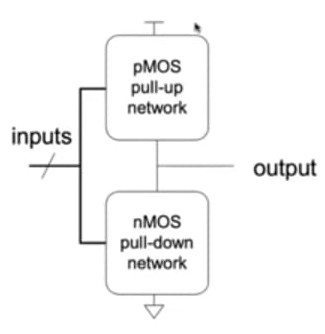
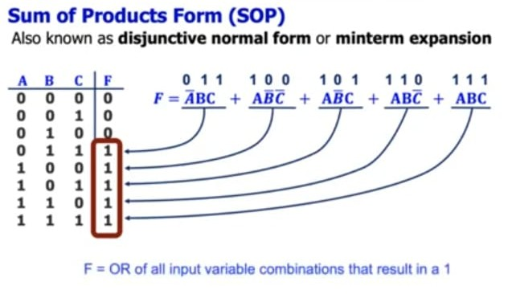
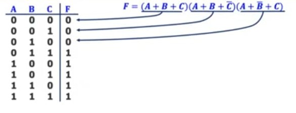
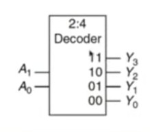
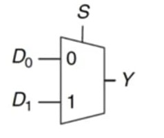
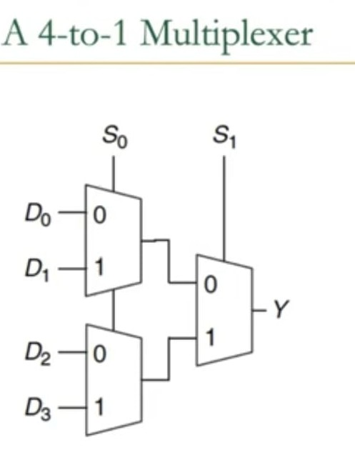

# LECTURE 2
## Boolean ALgerba and Basic combinational Blocks

### General CMOS Structure

The networks may consist of transistors in series or in parallel.

  

- When transistors are in **parallel**, the network is **ON** if **one** of the transistors is **ON**.

- When transistors are in **series**, the network is **ON** only if **all** transistors are **ON**.

### Hazard and Unknown Value

Exactly one network should be **ON**, and the other network should be **OFF** at any given time.

- If both networks are **ON** at the same time, there is a **short circuit** → likely incorrect operation.

- If both networks are **OFF** at the same time, the output is **floating** → undefined.

### MOS As Imperfect Switches

MOS transistors are **imperfect** switches  
- pMOS transistors pass 1's well but 0's poorly (holes carry charge)  
- nMOS transistors pass 0's well but 1's poorly (electrons can charge)

### Speed Of Different Networks

Series connections are slower than parallel connections
- More resistance on the wire

### Power Consumption

- **Dynamic Power Consumption**
  - Power used to charge capacitance as signals change (0 <-> 1)
  - C * V² * f
    - C = capacitance of the circuit (wires and gates)
    - V = supply voltage
    - f = charging frequency of the capacitor

- **Static Power Consumption**
  - Power used when signals do not change
  - V * I_{leakage}
    - supply voltage * leakage current

- **Energy Consumption**
  - Power * Time

--------------------------------------------------------------
## Functional Mapping

Functional specification of outputs in terms of inputs
- What do we mean by "function"?
  - Unique mapping from input values to output values
  - The same input values produce the same output value every time
  - No memory (output does not depend on past input values)

Example (full 1-bit adder):

$$
\begin{aligned}
S &= F(A, B, C_{in}) \\
C_{out} &= G(A, B, C_{in})
\end{aligned}
$$

Inputs:
$$
\begin{array}{c}
A \\
B \\
C_{in} \\
\end{array}
$$

Outputs:
$$
\begin{array}{c}
S \\
C_{out} \\
\end{array}
$$

Functions:
$$
\begin{aligned}
S &= A \oplus B \oplus C_{in} \quad &\text{(3-input XOR)} \\
C_{out} &= AB + AC_{in} + BC_{in} \quad &\text{(3-input majority)}
\end{aligned}
$$

--------------------------------------------------------------
## Boolean Axioms

# Boolean Algebra Axioms and Duality

| Axiom Name | Axiom | Dual Axiom |
|------------|-------|-----------|
| **Identity** | \( X + 0 = X \) | \(X . 1 = X \) |
| **Null Element** | \( X + 1 = 1 \) | \( X . 0 = 0 \) |
| **Idempotence** | \( X + X = X \) | \( X . X = X \) |
| **Involution** | \( (X')' = X \) | (Self-dual) |
| **Complements** | \( X + X' = 1 \) | \( X . X' = 0 \) |
| **Commutative** | \( X + Y = Y + X \) | \( X . Y = Y . X \) |
| **Associative** | \( X + (Y + Z) = (X + Y) + Z \) | \( X . (Y . Z) = (X . Y) . Z \) |
| **Distributive** | \( X + (Y . Z) = (X + Y) . (X + Z) \) | \( X . (Y + Z) = (X . Y) + (X . Z) \) |
| **Absorption** | \( X + (X . Y) = X \) | \( X . (X + Y) = X \) |
| **De Morgan's** | \( (X + Y)' = X' . Y' \) | \( (X . Y)' = X' + Y' \) |

**Duality Principle**: Any algebraic equality derived from these axioms remains valid when:
- All \( + \) and \( . \) operators are swapped
- All 0's and 1's are swapped
- NO change of literals with their complements

## General Concepts

- **Complement**: variable with a bar over it  
  $$ \overline{A}, \overline{B}, \overline{C} $$

- **Literal**: variable or its complement  
  $$ A, \overline{A}, B, \overline{B}, C, \overline{C} $$

- **Implicant**: product (AND) of literals  
  $$ (A \cdot B \cdot \overline{C}), (\overline{A} \cdot C), (B \cdot \overline{C}) $$

- **Minterm**: product (AND) that includes **all** input variables  
  $$ (A \cdot B \cdot \overline{C}), (\overline{A} \cdot \overline{B} \cdot C), (\overline{A} \cdot B \cdot \overline{C}) $$

- **Maxterm**: sum (OR) that includes **all** input variables  
  $$ (A + \overline{B} + \overline{C}), (\overline{A} + B + \overline{C}), (A + B + \overline{C}) $$

## SOP: SUM of PRODUCT Form

It is a minterm expression that is the sum of the all the minterms.

**Minterm** is all those terms in a truth table for which the output is **TRUE** or **1**

  

## POS: PRODUCT of SUM Form

It is a maxterm expression that is the sum of the all the maxterms.

**Maxterm** is all those terms in a truth table for which the output is **FALSE** or **0**

  

## Basic Combinational Blcoks

Hides the unnecessary gate level details to emphasize the functoin of the building block.
- Decoder
- Multiplexer
- Full Adder
- Comparator
- ALU
- PLA 
- Tri-state Buffer

### DECODER

# Decoder

- "Input pattern detector"
- n inputs and 2n outputs
- Exactly one of the outputs is 1 and all the rest are 0s
- The output that is logically 1 is the output corresponding to the input pattern that the logic circuit is expected to detect
- Example: 2-to-4 decoder

### Truth Table

| \( A_1 \) | \( A_0 \) | \( Y_3 \) | \( Y_2 \) | \( Y_1 \) | \( Y_0 \) |
|-----------|-----------|-----------|-----------|-----------|-----------|
| 0         | 0         | 0         | 0         | 0         | 1         |
| 0         | 1         | 0         | 0         | 1         | 0         |
| 1         | 0         | 0         | 1         | 0         | 0         |
| 1         | 1         | 1         | 0         | 0         | 0         |

  

## MULTIPLEXER

Selects one of the N inputs to connect it to the output  
based on the value of a log₂N-bit control input called "select"

## Example: 2-to-1 MUX

### Truth Table

| Select (S) | \( D_1 \) | \( D_0 \) | Output (Y) |
|------------|-----------|-----------|------------|
| 0          | 0         | 0         | 0          |
| 0          | 0         | 1         | 1          |
| 0          | 1         | 0         | 0          |
| 0          | 1         | 1         | 1          |
| 1          | 0         | 0         | 0          |
| 1          | 0         | 1         | 0          |
| 1          | 1         | 0         | 1          |
| 1          | 1         | 1         | 1          |

- 0 = Select \( D_0 \)
- 1 = Select \( D_1 \)

The ouput Y is always connected to either D_0 or D_1

  

We can have a 4x1 Mux using 3 of the 2x1 muxes as shown on the figure

  

## FULL ADDER

# Full Adder (I)

## Binary Addition
- Similar to decimal addition  
- From right to left  
- One column at a time  
- Produces one sum and one carry bit  

$$ a_{n-1}a_{n-2}...a_1a_0 $$
$$ b_{n-1}b_{n-2}...b_1b_0 $$
$$ C_nC_{n-1}...C_1 $$
$$ S_{n-1}...S_1S_0 $$

## Truth Table
Represents binary addition for one column of bits within two n-bit operands:

$$
\begin{array}{|c|c|c|c|c|}
\hline
a_i & b_i & carry_i & carry_{i+1} & S_i \\
\hline
0 & 0 & 0 & 0 & 0 \\
0 & 0 & 1 & 0 & 1 \\
0 & 1 & 0 & 0 & 1 \\
0 & 1 & 1 & 1 & 0 \\
1 & 0 & 0 & 0 & 1 \\
1 & 0 & 1 & 1 & 0 \\
1 & 1 & 0 & 1 & 0 \\
1 & 1 & 1 & 1 & 1 \\
\hline
\end{array}
$$

**Key:**
- \( a_i, b_i \): Input bits
- \( carry_i \): Input carry
- \( carry_{i+1} \): Output carry
- \( S_i \): Sum bit