# LECTURE 1
## Basics of Design Systems

## Computer Architecture

### What is Computer Architecture?

**Computer Architecture** refers to the conceptual design and fundamental operational structure of a computer system. It defines how the computer's hardware components interact, how data is processed, and how instructions are executed.

### Main Components

- **Instruction Set Architecture (ISA)**  
  The set of instructions that the hardware can execute.

- **Microarchitecture**  
  The internal organization of the processor that implements the ISA (e.g., pipelines, ALUs, control units).

- **System Architecture**  
  The broader system design including memory hierarchy, input/output subsystems, buses, and communication between components.

### Importance

Computer architecture plays a crucial role in determining the performance, efficiency, and capabilities of computing systems. It forms the foundation for building processors, embedded systems, and large-scale computing infrastructures.

### 1- Steps to follow to solve a Problem.

  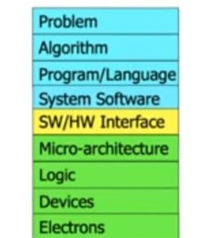

### 2- Devices

## Transistors as Switches

Transistors are fundamental building blocks of digital electronics. When used as switches, they can turn ON or OFF the flow of electrical current, enabling binary operations (`1` and `0`) that are the basis of logic gates and digital circuits.

### Key Concepts

- **Types of Transistors**: The most commonly used types in digital logic are:
  - **NMOS (N-type MOSFET)**
  - **PMOS (P-type MOSFET)**

  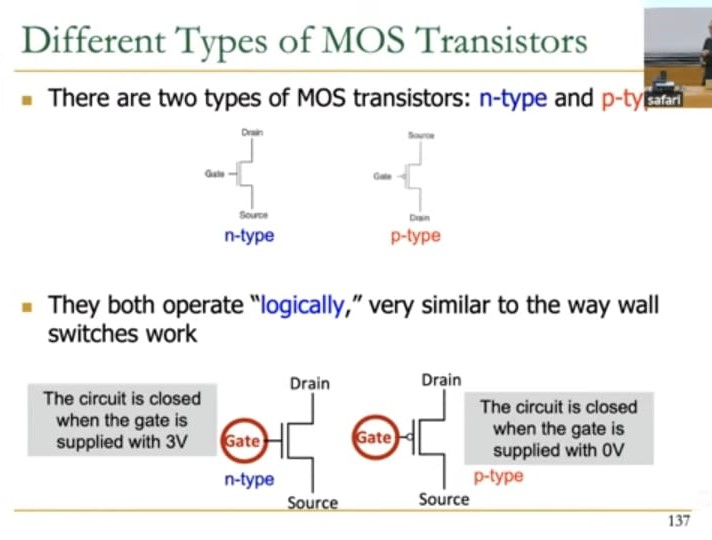

### Switching Behavior

| Transistor Type | Gate Voltage | State | Conducts Current? |
|-----------------|--------------|-------|-------------------|
| **NMOS**        | High (1)     | ON    | Yes               |
| **NMOS**        | Low (0)      | OFF   | No                |
| **PMOS**        | Low (0)      | ON    | Yes               |
| **PMOS**        | High (1)     | OFF   | No                |

- **NMOS** transistors turn **ON** when a high voltage is applied to the gate.
- **PMOS** transistors turn **ON** when a low voltage is applied to the gate.
- This complementary behavior is used in CMOS (Complementary MOS) technology, which combines NMOS and PMOS transistors for low-power and high-speed digital circuits.
- **PMOS** are used as pulled up technology.
- **NMOS** are used as pulled down technology.

### Logic Gate Example

Using transistors as switches, we can build basic logic gates like:

  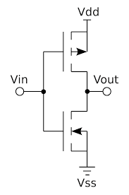

- **NOT Gate** using a single NMOS and resistor.
- **NAND and NOR Gates** using combinations of NMOS and PMOS transistors.

### Importance

- Transistors as switches are the basis of **digital logic**, **memory storage**, and **microprocessors**.
- Billions of transistors are integrated into modern CPUs and GPUs to perform complex computations.

### Voltage Effect

More the voltage is high it is easy to distinguish betweeen **HIGH** and **LOW**  like between **0V** and **3V**, but it has more power consumption.

More the voltage is low it is hard to distinguish betweeen **HIGH** and **LOW**  like between **0V** and **0.3V**, but it has less power consumption.

------------------------------------------------------------------------------------------------------

# LECTURE 2
## Boolean ALgerba and Basic combinational Blocks

### General CMOS Structure

The networks may consist of transistors in series or in parallel.

  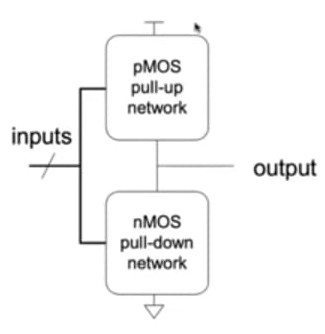

- When transistors are in **parallel**, the network is **ON** if **one** of the transistors is **ON**.

- When transistors are in **series**, the network is **ON** only if **all** transistors are **ON**.

### Hazard and Unknown Value

Exactly one network should be **ON**, and the other network should be **OFF** at any given time.

- If both networks are **ON** at the same time, there is a **short circuit** → likely incorrect operation.

- If both networks are **OFF** at the same time, the output is **floating** → undefined.

### MOS As Imperfect Switches

MOS transistors are **imperfect** switches  
- pMOS transistors pass 1's well but 0's poorly (holes carry charge)  
- nMOS transistors pass 0's well but 1's poorly (electrons can charge)

### Speed Of Different Networks

Series connections are slower than parallel connections
- More resistance on the wire

### Power Consumption

- **Dynamic Power Consumption**
  - Power used to charge capacitance as signals change (0 <-> 1)
  - C * V² * f
    - C = capacitance of the circuit (wires and gates)
    - V = supply voltage
    - f = charging frequency of the capacitor

- **Static Power Consumption**
  - Power used when signals do not change
  - V * I_{leakage}
    - supply voltage * leakage current

- **Energy Consumption**
  - Power * Time

--------------------------------------------------------------
## Functional Mapping

Functional specification of outputs in terms of inputs
- What do we mean by "function"?
  - Unique mapping from input values to output values
  - The same input values produce the same output value every time
  - No memory (output does not depend on past input values)

Example (full 1-bit adder):

$$
\begin{aligned}
S &= F(A, B, C_{in}) \\
C_{out} &= G(A, B, C_{in})
\end{aligned}
$$

Inputs:
$$
\begin{array}{c}
A \\
B \\
C_{in} \\
\end{array}
$$

Outputs:
$$
\begin{array}{c}
S \\
C_{out} \\
\end{array}
$$

Functions:
<pre>
  S = A ⊕ B ⊕ Cin  (3-input XOR)
  Cout = AB + ACin + BCin  (3-input majority)
</pre>

--------------------------------------------------------------
## Boolean Axioms

# Boolean Algebra Axioms and Duality

| Axiom Name | Axiom | Dual Axiom |
|------------|-------|-----------|
| **Identity** | \( X + 0 = X \) | \(X . 1 = X \) |
| **Null Element** | \( X + 1 = 1 \) | \( X . 0 = 0 \) |
| **Idempotence** | \( X + X = X \) | \( X . X = X \) |
| **Involution** | \( (X')' = X \) | (Self-dual) |
| **Complements** | \( X + X' = 1 \) | \( X . X' = 0 \) |
| **Commutative** | \( X + Y = Y + X \) | \( X . Y = Y . X \) |
| **Associative** | \( X + (Y + Z) = (X + Y) + Z \) | \( X . (Y . Z) = (X . Y) . Z \) |
| **Distributive** | \( X + (Y . Z) = (X + Y) . (X + Z) \) | \( X . (Y + Z) = (X . Y) + (X . Z) \) |
| **Absorption** | \( X + (X . Y) = X \) | \( X . (X + Y) = X \) |
| **De Morgan's** | \( (X + Y)' = X' . Y' \) | \( (X . Y)' = X' + Y' \) |

**Duality Principle**: Any algebraic equality derived from these axioms remains valid when:
- All \( + \) and \( . \) operators are swapped
- All 0's and 1's are swapped
- NO change of literals with their complements

## General Concepts

- **Complement**: variable with a bar over it  
  - A̅, B̅, C̅

- **Literal**: variable or its complement  
  - A, A̅, B, B̅, C, C̅

- **Implicant**: product (AND) of literals  
  - (A · B · C̅), (A̅ · C), (B · C̅)

- **Minterm**: product (AND) that includes **all** input variables  
  - (A · B · C̅), (A̅ · B̅ · C), (A̅ · B · C̅)

- **Maxterm**: sum (OR) that includes **all** input variables  
  - (A + B̅ + C̅), (A̅ + B + C̅), (A + B + C̅)

## SOP: SUM of PRODUCT Form

It is a minterm expression that is the sum of the all the minterms.

**Minterm** is all those terms in a truth table for which the output is **TRUE** or **1**

  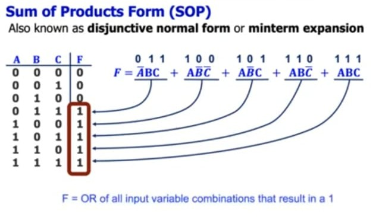

## POS: PRODUCT of SUM Form

It is a maxterm expression that is the sum of the all the maxterms.

**Maxterm** is all those terms in a truth table for which the output is **FALSE** or **0**

  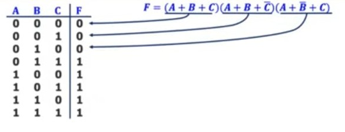

## Basic Combinational Blcoks

Hides the unnecessary gate level details to emphasize the functoin of the building block.
- Decoder
- Multiplexer
- Full Adder
- Comparator
- ALU
- PLA 
- Tri-state Buffer

### DECODER

# Decoder

- "Input pattern detector"
- n inputs and 2n outputs
- Exactly one of the outputs is 1 and all the rest are 0s
- The output that is logically 1 is the output corresponding to the input pattern that the logic circuit is expected to detect
- Example: 2-to-4 decoder

### Truth Table

| \( A_1 \) | \( A_0 \) | \( Y_3 \) | \( Y_2 \) | \( Y_1 \) | \( Y_0 \) |
|-----------|-----------|-----------|-----------|-----------|-----------|
| 0         | 0         | 0         | 0         | 0         | 1         |
| 0         | 1         | 0         | 0         | 1         | 0         |
| 1         | 0         | 0         | 1         | 0         | 0         |
| 1         | 1         | 1         | 0         | 0         | 0         |

  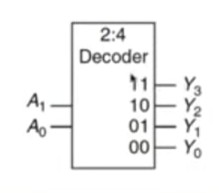

## MULTIPLEXER

Selects one of the N inputs to connect it to the output  
based on the value of a log₂N-bit control input called "select"

## Example: 2-to-1 MUX

### Truth Table

| Select (S) | \( D_1 \) | \( D_0 \) | Output (Y) |
|------------|-----------|-----------|------------|
| 0          | 0         | 0         | 0          |
| 0          | 0         | 1         | 1          |
| 0          | 1         | 0         | 0          |
| 0          | 1         | 1         | 1          |
| 1          | 0         | 0         | 0          |
| 1          | 0         | 1         | 0          |
| 1          | 1         | 0         | 1          |
| 1          | 1         | 1         | 1          |

- 0 = Select \( D_0 \)
- 1 = Select \( D_1 \)

The ouput Y is always connected to either D_0 or D_1

  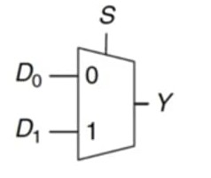

We can have a 4x1 Mux using 3 of the 2x1 muxes as shown on the figure

  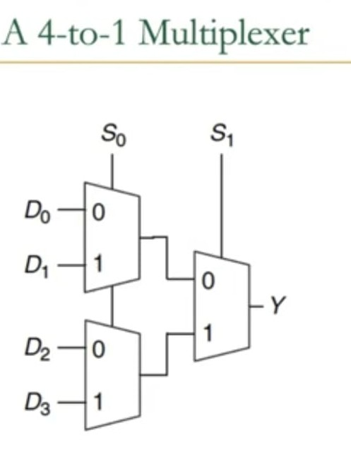

## FULL ADDER

# Full Adder (I)

## Binary Addition
- Similar to decimal addition  
- From right to left  
- One column at a time  
- Produces one sum and one carry bit  

$$ a_{n-1}a_{n-2}...a_1a_0 $$
$$ b_{n-1}b_{n-2}...b_1b_0 $$
$$ C_nC_{n-1}...C_1 $$
$$ S_{n-1}...S_1S_0 $$

## Truth Table
Represents binary addition for one column of bits within two n-bit operands:

$$
\begin{array}{|c|c|c|c|c|}
\hline
a_i & b_i & carry_i & carry_{i+1} & S_i \\
\hline
0 & 0 & 0 & 0 & 0 \\
0 & 0 & 1 & 0 & 1 \\
0 & 1 & 0 & 0 & 1 \\
0 & 1 & 1 & 1 & 0 \\
1 & 0 & 0 & 0 & 1 \\
1 & 0 & 1 & 1 & 0 \\
1 & 1 & 0 & 1 & 0 \\
1 & 1 & 1 & 1 & 1 \\
\hline
\end{array}
$$

**Key:**
- \( a_i, b_i \): Input bits
- \( carry_i \): Input carry
- \( carry_{i+1} \): Output carry
- \( S_i \): Sum bit

----------------------------------------------------------------------------
# LECTURE 3
# SEQUENTIAL LOGIC

## COMPARATOR (EQUALITY)

Checks if two N inputs are exactly the same 

  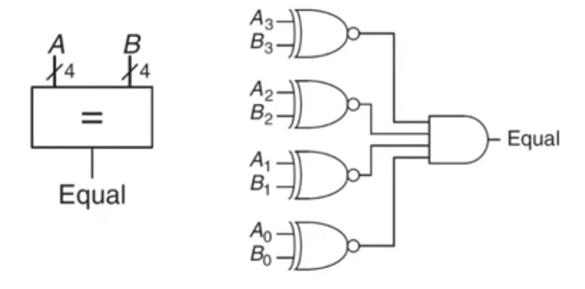

## TRI-STATE BUFFER

A tri-state buffer enables gating of different signals on a wire.

  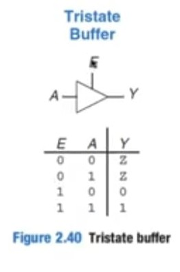
    
where Z is the floating signal

  </img>

### Example of tri-state buffer

  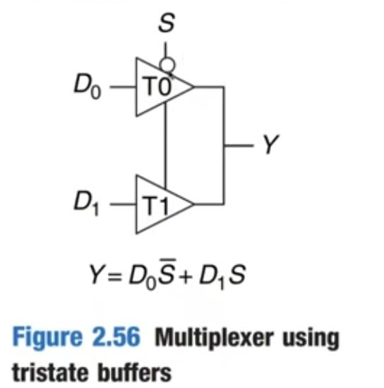

### Uniting Therom

  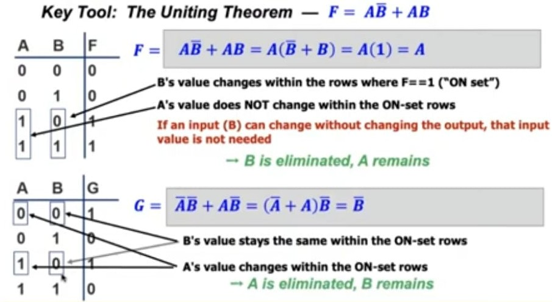

## SEQUENTIAL CIRCUITS
Sequential circuits depends on the currnet input as well as the previous inputs also i.e htey have memory element present in them.

  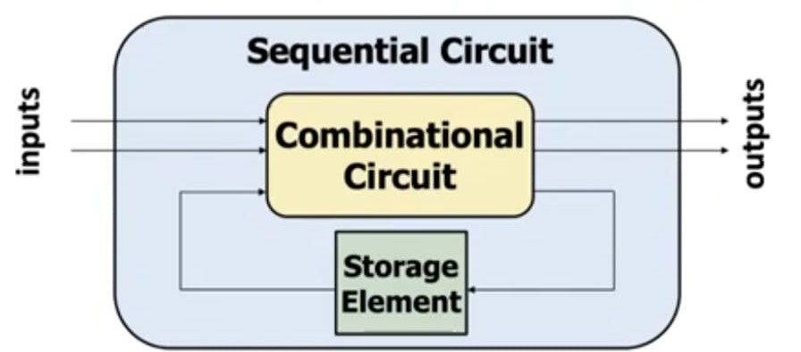

## Capturing Data

### The R-S (Reset-Set) Latch

- **Cross-coupled NAND gates**
  - Data is stored at **Q** (inverse at **Q'**)
  - **S** and **R** are control inputs
    - In *quiescent (idle)* state, both **S** and **R** are held at 1
    - **S (set)**: drive **S** to 0 (keeping **R** at 1) to change **Q** to 1
    - **R (reset)**: drive **R** to 0 (keeping **S** at 1) to change **Q** to 0
    - **S** and **R** should never both be 0 at the same time

  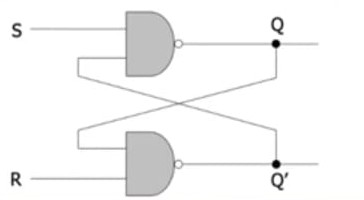

### D-LATCH

  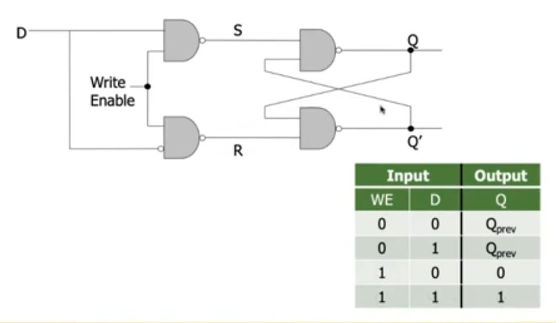

### REGISTER
Register store data.They are made up of D-Latches to store data

To store more than 1 bit of data use more than 1 D-Latch in parallel wit each other.

  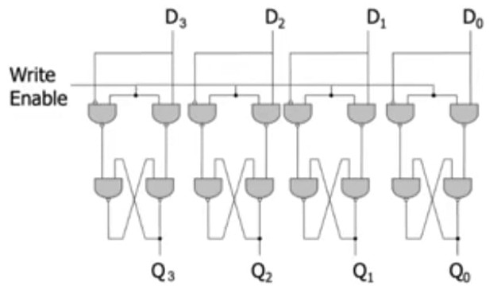

where D3 is the MSB and D0 is the LSB

Memory uses the regiters so to store or read from a specific register in memory we have addresses to that register.

## FLIP FLOP

A flip flop is a combination of 2 D-Latches that operate with a clock either on the rising edge or the falling edge.

One of the 2 D-Latches acts as the transparent latch and the other stores the data.

----------------------------------------------------------------------------

# LECTURE 4 

## FINITE STATE MACHINE

# Introduction to Finite State Machines (FSM)

A **Finite State Machine (FSM)** is a computational model used to design both computer programs and sequential logic circuits. It consists of a finite number of **states**, **transitions** between those states, and **inputs** that trigger the transitions.

FSMs are widely used in digital systems for control logic. The system is always in one of the states, and based on the input, it may transition to another state. There are two main types of FSMs:

- **Moore Machine** – Output depends only on the current state.
- **Mealy Machine** – Output depends on both the current state and the input.

FSMs are commonly used in applications such as vending machines, traffic light controllers, and communication protocols.

  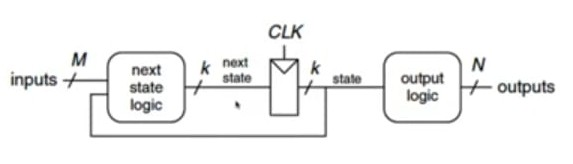

## Mealy and Moore Machines

### Moore Machine
In a **Moore machine**, the output depends **only on the current state**. This means the output is updated only when the system transitions to a new state.

**Characteristics:**
- Output is stable and changes only when the state changes.
- Typically requires more states than a Mealy machine for the same functionality.
- Easier to design and debug due to output-state separation.

**Example Use Case:** Traffic light controllers.

### Mealy Machine
In a **Mealy machine**, the output depends on **both the current state and the input**. This means the output can change in the middle of a state based on input changes.

**Characteristics:**
- Can react faster to inputs since outputs can change without waiting for a state change.
- Usually requires fewer states than a Moore machine for the same functionality.
- More complex to design and test.

**Example Use Case:** Serial data transmitters or receivers, where output must immediately reflect input changes.

## FSM State Encoding

**State encoding** is the process of assigning binary values (codes) to the states in a Finite State Machine (FSM). It is an important step in implementing FSMs in hardware, especially using flip-flops and logic gates.

There are several common state encoding methods:

### 1. Binary Encoding
Each state is assigned a unique binary number using the minimum number of bits.

- **Advantages:** Uses fewer flip-flops (minimum hardware).
- **Disadvantages:** Can result in more complex logic circuits for state transitions and outputs.

### 2. One-Hot Encoding
Each state is represented by a flip-flop, and only one flip-flop (bit) is '1' (hot) at a time.

- **Advantages:** Simplifies next-state and output logic.
- **Disadvantages:** Requires more flip-flops (one per state).

### 3. Gray Encoding
States are encoded such that only one bit changes between successive states.

- **Advantages:** Reduces transition glitches in noisy environments.
- **Disadvantages:** Not as commonly used in FSMs; more suited for counters.

**Choosing an encoding scheme** depends on trade-offs between logic complexity, speed, power, and available resources.

## FSM Output Encoding

**Output encoding** defines how the outputs of the FSM are generated based on its states and/or inputs. The method used depends on whether the FSM is a Moore or Mealy machine.

### 1. Moore Output Encoding
- Outputs are associated **only with states**.
- Each state has a fixed output value.
- Outputs change only when the FSM transitions to a different state.
- Easier to debug and more stable.

### 2. Mealy Output Encoding
- Outputs are associated with **state-input pairs**.
- Outputs can change immediately in response to input changes, even without a state transition.
- Can result in fewer states compared to Moore machines, but may introduce glitches due to immediate response to inputs.

**Note:** When implementing FSMs in digital systems, the output logic must be carefully designed to ensure correct timing and behavior of the circuit.

# HARDWARE DESCRIPTIVE LANGUAGE

- These are the language that enable easy description of hardware structure like:

  - wires, gates, registers, flip flops, clock, rising/falling edge of clock
  - combinational and sequential logic elements

- Enables seamless expresion of parallelism inherent in hardware

## HEIRARCHY LEVEL OF MODULES

## Top-Down Design Methodology

- We define the **top-level module** and identify the **sub-modules** necessary to build the top-level module.
- Subdivide the sub-modules until we come to **leaf cells**.
  - **Leaf cell**: Circuit components that cannot further be divided (e.g., *logic gates*, *primitive cell library elements*).

### Module Hierarchy

  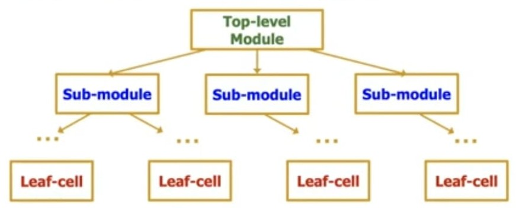

## DEFINING MODULES

A **module** is the building block in HDL

We first define 
- **Name** of the module
- **Direction** of its ports(input , output)
- **Name** of the ports

  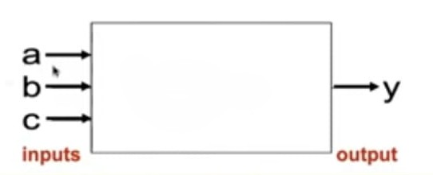

----------------------------------------------------------------------------
