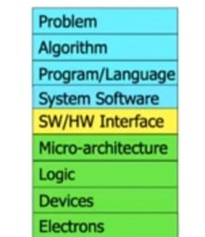
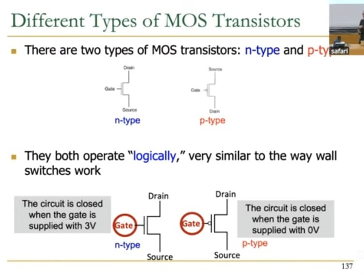
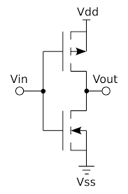

# LECTURE 1
## Basics of Design Systems

## Computer Architecture

### What is Computer Architecture?

**Computer Architecture** refers to the conceptual design and fundamental operational structure of a computer system. It defines how the computer's hardware components interact, how data is processed, and how instructions are executed.

### Main Components

- **Instruction Set Architecture (ISA)**  
  The set of instructions that the hardware can execute.

- **Microarchitecture**  
  The internal organization of the processor that implements the ISA (e.g., pipelines, ALUs, control units).

- **System Architecture**  
  The broader system design including memory hierarchy, input/output subsystems, buses, and communication between components.

### Importance

Computer architecture plays a crucial role in determining the performance, efficiency, and capabilities of computing systems. It forms the foundation for building processors, embedded systems, and large-scale computing infrastructures.

### 1- Steps to follow to solve a Problem.

  

### 2- Devices

## Transistors as Switches

Transistors are fundamental building blocks of digital electronics. When used as switches, they can turn ON or OFF the flow of electrical current, enabling binary operations (`1` and `0`) that are the basis of logic gates and digital circuits.

### Key Concepts

- **Types of Transistors**: The most commonly used types in digital logic are:
  - **NMOS (N-type MOSFET)**
  - **PMOS (P-type MOSFET)**

  

### Switching Behavior

| Transistor Type | Gate Voltage | State | Conducts Current? |
|-----------------|--------------|-------|-------------------|
| **NMOS**        | High (1)     | ON    | Yes               |
| **NMOS**        | Low (0)      | OFF   | No                |
| **PMOS**        | Low (0)      | ON    | Yes               |
| **PMOS**        | High (1)     | OFF   | No                |

- **NMOS** transistors turn **ON** when a high voltage is applied to the gate.
- **PMOS** transistors turn **ON** when a low voltage is applied to the gate.
- This complementary behavior is used in CMOS (Complementary MOS) technology, which combines NMOS and PMOS transistors for low-power and high-speed digital circuits.
- **PMOS** are used as pulled up technology.
- **NMOS** are used as pulled down technology.

### Logic Gate Example

Using transistors as switches, we can build basic logic gates like:

  

- **NOT Gate** using a single NMOS and resistor.
- **NAND and NOR Gates** using combinations of NMOS and PMOS transistors.

### Importance

- Transistors as switches are the basis of **digital logic**, **memory storage**, and **microprocessors**.
- Billions of transistors are integrated into modern CPUs and GPUs to perform complex computations.

### Voltage Effect

More the voltage is high it is easy to distinguish betweeen **HIGH** and **LOW**  like between **0V** and **3V**, but it has more power consumption.

More the voltage is low it is hard to distinguish betweeen **HIGH** and **LOW**  like between **0V** and **0.3V**, but it has less power consumption.